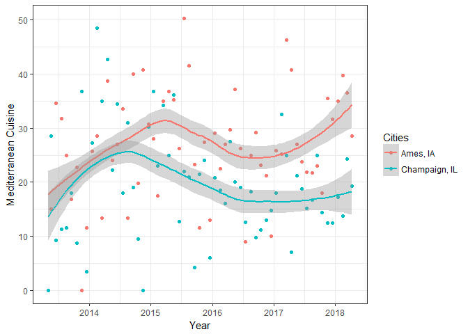
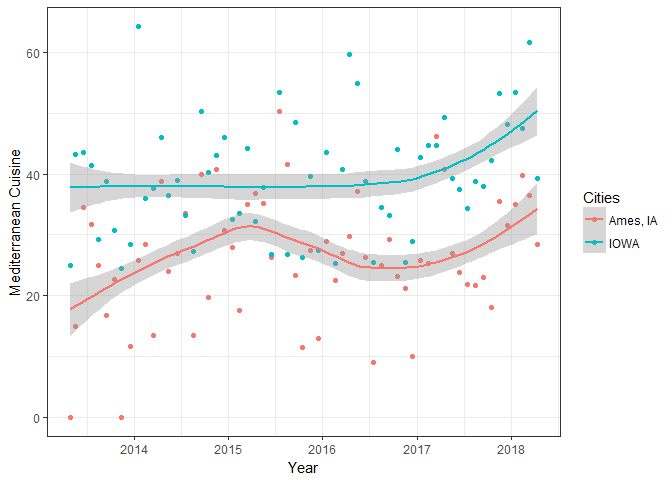
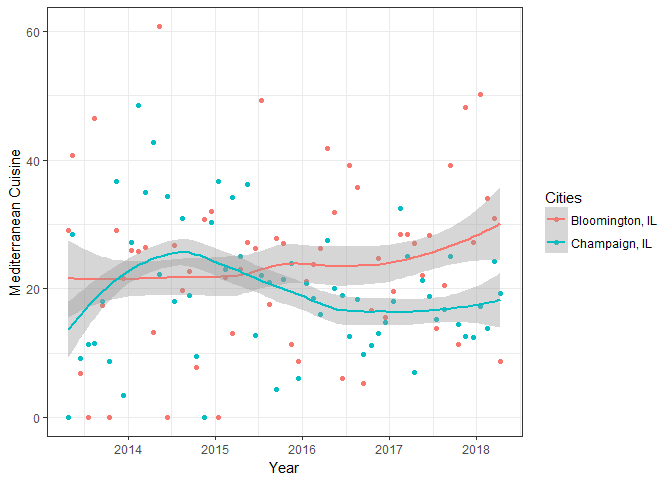

City Matching
================

It is not an easy decision to make an investment without any in advance analysis of the market or to find a niche market to invest. I suggest a model that finds similar markets/cities and analyze the trend over there before one decides to spend millions of dollars.

I'll try to find similar US cities so I can check people's choices for these matched cities. Some of these features are listed below:

-   Unemployment Rate
-   Median Family Income
-   Population distribution
-   Elections Results
-   Education Level

I used <https://www.census.gov/> as the main data source. I can find/use different sources while advancing this idea.

I will use different matching methods,*Mahalanobis*, *Propensity Score*, *Genetic* or *Inverse Variance Matching*, for different features types. I plan to use sensitivity analysis to check matching quality as well. I can leverage from several R packages, dedicated to matching analysis. I believe checking matched city's trends is very effective simulation without deciding many complicated decision mechanisms into consideration.

Finding a niche business and invest in this business isn't a niche idea if you are aiming the online market since people can detect this new trend and invest much more than you. I will find niece investment ideas that the success was proven in a matched community.

Let's see if we can detect similar cities have the same trend. For this reason, I checked for several features, listed below the names of cities, and find matched 2 cities: Ames, IO, and Champaign, IL.

  **Ames, Iowa**

-   Population: 66,191
-   Percent with a bachelor's degree: 61.8%
-   Unemployement 6%
-   Median Family Income $78,323
-   Foreign Born Persons 12.3%
-   Mean travel time to work 16.1%

  **Champaign, Illinois**

-   Population: 86,637
-   Percent with a bachelor's degree: 43.9%
-   Unemployement 5.5%
-   Median Family Income $73,628
-   Foreign Born Persons 11.5%
-   Mean travel time to work 18%

After finding 2 matched cities let's check if these 2 cities have the similar response for the same term. I checked for *Mediterrian Cuisine*. It seems these matched cities have similar Google trend so if one decides to start a Greek restaurant at Ames we can check the situation at Champaign and suggest the investor whether it is a good idea or not.

``` r
Ames <- as_tibble(fread("Ames-IOWA.csv"))
Champaign <- as_tibble(fread("Champaign.csv"))
names(Ames) = names(Champaign) = c('Date','Med_Cuisine')

Ames = Ames %>% mutate(Date = ymd(Date),
                       Month = month(Date),
                       Year = year(Date),
                       Cities = "Ames, IA")
Ames = Ames %>% group_by(Year,Month) %>% mutate(Med_Cuisine_mn = mean(Med_Cuisine)
                                                ,Dt = mean(Date))
Champaign = Champaign %>% mutate(Date = ymd(Date),
                       Month = month(Date),
                       Year = year(Date),
                       Cities = "Champaign, IL")
Champaign = Champaign %>% group_by(Year,Month) %>% mutate(Med_Cuisine_mn = mean(Med_Cuisine)
                                                ,Dt = mean(Date))

Comb = bind_rows(Ames,Champaign)


  ggplot(Comb,aes(x=Dt,y=Med_Cuisine_mn,colour = Cities))+
  geom_point()+
  geom_smooth(method = 'loess',se = T) + 
  theme_bw() +
  xlab("Year") +
  ylab("Mediterranean Cuisine") 
```



One can think the trend for these 2 cities are same for the whole state that the cities are located in. If we check Google Trends for the whole IOWA and Ames, we see these two trends don't seem similar.

``` r
Ames <- as_tibble(fread("Ames-IOWA.csv"))
IOWA <- as_tibble(fread("iowa.csv"))
names(Ames) = names(IOWA) = c('Date','Med_Cuisine')

Ames = Ames %>% mutate(Date = ymd(Date),
                       Month = month(Date),
                       Year = year(Date),
                       Cities = "Ames, IA")
Ames = Ames %>% group_by(Year,Month) %>% mutate(Med_Cuisine_mn = mean(Med_Cuisine)
                                                ,Dt = mean(Date))
IOWA = IOWA %>% mutate(Date = ymd(Date),
                       Month = month(Date),
                       Year = year(Date),
                       Cities = "IOWA")
IOWA = IOWA %>% group_by(Year,Month) %>% mutate(Med_Cuisine_mn = mean(Med_Cuisine)
                                                ,Dt = mean(Date))

Comb = bind_rows(Ames,IOWA)


  ggplot(Comb,aes(x=Dt,y=Med_Cuisine_mn,colour = Cities))+
  geom_point()+
  geom_smooth(method = 'loess',se = T) + 
  theme_bw() +
  xlab("Year") +
  ylab("Mediterranean Cuisine") 
```



Another claim might be to check a close city as a matched city so we can check the trends there before we decide. Bloomington is a close city to Champaign, but we see Ames is a better choice to see similar trends.

``` r
Bloomington <- as_tibble(fread("bloomington.csv"))
Champaign <- as_tibble(fread("Champaign.csv"))
names(Bloomington) = names(Champaign) = c('Date','Med_Cuisine')

Bloomington = Bloomington %>% mutate(Date = ymd(Date),
                       Month = month(Date),
                       Year = year(Date),
                       Cities = "Bloomington, IL")
Bloomington = Bloomington %>% group_by(Year,Month) %>% mutate(Med_Cuisine_mn = mean(Med_Cuisine)
                                                ,Dt = mean(Date))
Champaign = Champaign %>% mutate(Date = ymd(Date),
                       Month = month(Date),
                       Year = year(Date),
                       Cities = "Champaign, IL")
Champaign = Champaign %>% group_by(Year,Month) %>% mutate(Med_Cuisine_mn = mean(Med_Cuisine)
                                                ,Dt = mean(Date))

Comb = bind_rows(Bloomington,Champaign)


  ggplot(Comb,aes(x=Dt,y=Med_Cuisine_mn,colour = Cities))+
  geom_point()+
  geom_smooth(method = 'loess',se = T) + 
  theme_bw() +
  xlab("Year") +
  ylab("Mediterranean Cuisine") 
```


